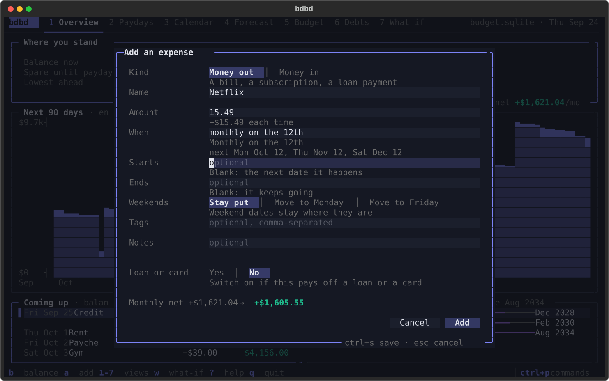

<h1 align="center">bdbd</h1>

<p align="center">
  <b>A beautiful budget in your terminal.</b><br>
  Your incomes, bills and debts, projected day by day, so you always know what's spare until payday.
</p>

<p align="center">
  <a href="https://github.com/adamtrain/bdbd/actions/workflows/ci.yml"></a>
  
  <a href="https://github.com/astral-sh/uv"></a>
  <a href="https://github.com/astral-sh/ruff"></a>
  <a href="LICENSE"></a>
</p>

<p align="center">
  
</p>

## Why bdbd

- **Where you stand, at a glance.** Run `bdbd` and see your balance, the money that's spare until
  payday, the lowest your balance will get, what's coming up and when each debt is gone.
- **What each paycheck leaves you.** On payday, Paydays says what's free to spend or save once
  the bills due before the next paycheck (and your everyday spending) are covered, and charts
  every paycheck a year ahead, so the tight ones stand out.
- **Seven views, a keypress apart.** Overview, Paydays, Calendar, Forecast, Budget, Debts and
  What if sit on `1` to `7`. Enter on anything opens it, and `?` lists the keys that work where
  you are.
- **Say it the way you'd say it.** Type "every 2 weeks on fri" or "yearly on the 3rd tuesday of
  november" and the form shows the next few dates as you type. Dates can be `fri`, `oct 15`,
  `+3w` or `eom`.
- **Your balance, carried forward.** Press `b` whenever you check your account. bdbd carries that
  balance through your budget day by day, and when you update it, it tells you how far reality
  has drifted from the plan.
- **Real debt math.** Simple, daily, monthly and continuous interest, rate changes, extra
  payments and payoffs, with amortization tables checked to the cent. No floats anywhere.
- **What-ifs that change nothing.** Sell the car, book a trip, pay a card off early: the What if
  view says whether it catches up, finds the earliest date that works, and every other view can
  show your budget with it. Nothing is saved until you make the change for real.
- **Built for agents too.** Every `bdbd COMMAND` prints one JSON object, with `--select` to keep
  it small and `bdbd guide` documenting every field.
- **One file, all yours.** Everything lives in a single sqlite file on your machine. No
  account, no server, no sync. The app reloads when something else changes the file.

## Install

You'll need [uv](https://docs.astral.sh/uv/).

```sh
uv tool install git+https://github.com/adamtrain/bdbd
bdbd
```

That puts `bdbd` on your `PATH`, and the first time you run it, it offers to create an empty
budget at `~/.config/bdbd/budget.sqlite`. To use a budget somewhere else, point `BDBD_DB` at it
(or pass `--db PATH`):

```sh
export BDBD_DB=~/Documents/budget.sqlite
```

To hack on bdbd, clone the repo and install it in editable mode, so your changes take effect
right away:

```sh
git clone https://github.com/adamtrain/bdbd && cd bdbd
uv tool install --editable .
```

## Getting started

1. Press `a` to add your paycheck: its amount and when it comes ("every 2 weeks on fri"). The
   first thing you add is money in; after that, `a` adds money out. Your paycheck is your
   payday: each one starts a pay cycle.
2. Press `a` for each bill: rent, insurance, subscriptions. For a loan or a card, switch on
   **Loan or card** and give what's owed and the rate.
3. Press `,` for settings and set your everyday spending: groceries and the like, spread over
   each day.
4. Press `b` and type what's in your account right now.

The Overview then shows where that leaves you.

<p align="center">
  
</p>

## The views

**Paydays** (`2`) takes one pay cycle at a time, from a payday to the day before the next: the
paycheck, the bills that land in the cycle, and what's free to spend or save once they and your
everyday spending are paid. A chart shows what's left of every paycheck for the next 12 months:
green for what's free, red for what's short, and a grey cap for what everyday spending takes.
Click a column to see its cycle. `v` leaves everyday spending out, and `p` picks which incomes
are paydays (your paycheck is; a refund isn't, though its money counts in the cycle it lands in).

<p align="center">
  
</p>

**Calendar** (`3`) lays a month out day by day: what lands on each day (paychecks in green, debt
payments in purple) and the balance at the end of every day from today on. Beside it, the
selected day in full, and the month's money in and out.

<p align="center">
  
</p>

**Forecast** (`4`) runs your budget forward, from a month to five years or to any day you name:
where you end up, what's spare then, the lowest point on the way, what the debts cost, and
every transaction or a month-by-month table.

<p align="center">
  
</p>

**Budget** (`5`) is every flow with its schedule, its next date and what it costs a month, or
the same money by tag. The card beside the list says everything about the one you're on, and
`e`, `space` and `x` edit, pause and delete it.

<p align="center">
  
</p>

**Debts** (`6`) is what you owe and when it's gone: each debt's balance, rate and payoff date,
its terms and recorded events, and every payment to come. `r` records an extra payment, a new
rate or a payoff.

<p align="center">
  
</p>

`p` works out a payoff plan: an extra amount each month, one debt at a time, each freed payment
rolling into the next.

<p align="center">
  
</p>

**What if** (`7`) tries changes without saving them: sell something and clear its loan, add a
one-off, stop a bill, change a payment or a rate. It compares the result with your budget as
it is, or, when a date is `?`, finds the earliest one that keeps your balance above a floor.
While it's on, every other view shows your budget with it, and `w` turns it off.

<p align="center">
  
</p>

## Keys

| | |
| --- | --- |
| `1`–`7` | Overview, Paydays, Calendar, Forecast, Budget, Debts, What if |
| `a` | Add: a flow, or whatever the view adds (a debt, a what-if change) |
| `b` | Record your balance |
| `enter` | Open what's selected: a flow's card, a day's items, a month |
| `w` | The what-if on or off |
| `ctrl+p` or `:` | Commands, and any flow by name |
| `,` | Settings: everyday spending, where the budget lives, backups |
| `?` | Help: the keys that work where you are |
| `q` | Quit (bdbd asks first if a what-if would be lost) |

Lists move with the arrow keys, and the mouse works too: click to select, double-click to open,
and click a choice in a panel's border (like a forecast's `1y`) to pick it.

## Reading the numbers

| | |
| --- | --- |
| **Balance** | Cash on hand before today's scheduled items. `b` records it; everything starts from the latest one, carried forward day by day. |
| **Spare** | Your balance plus everything that comes and goes before your next payday: bills and everyday spending out, any other money (a refund) in on its day. It's what you'll have left the day before your paycheck. |
| **Everyday spending** | Groceries and incidentals, charged a little each day in every projection. Set it in settings (`,`). |
| **Lowest** | The lowest end-of-day balance ahead: the day to watch. |
| **Free to spend or save** | What's left of a paycheck once the bills in its pay cycle (payday to the day before the next) and its everyday spending are paid. |
| **Next 12 months** | What a flow really brings in or costs over the coming year, on its dates, so an end date or a loan's payoff cuts it short. |
| **Interest to go** | What a debt will still cost from today, so what's owed plus the interest to go is everything left to pay. |
| **◆** | A debt payment. Its interest and principal split comes from the loan's own terms. |
| **→Mon** | This flow's weekend dates move to Monday, the way an ACH pull does. |
| **↳** | Only in the what-if: it isn't in your budget. |

Balances turn amber below one week of everyday spending, and red below zero.

## For agents and scripts

Every command prints one JSON envelope on stdout. Nothing ever prompts, errors come back as
JSON too, and `--select` keeps only the fields you ask for:

```sh
$ bdbd project --until dec 12 --select spare_balance,spare.next_payday,opening.source
{"ok":true,"command":"project","data":{"spare_balance":"8480.72","spare.next_payday":{"date":"2026-12-25","name":"Paycheck","amount":"2650.00"},"opening.source":"carried"},"warnings":[]}
```

`bdbd overview` is the Overview's numbers, and the other commands cover everything the app does:
`add`, `edit`, `rm`, `pause`, `balance`, `debt …`, `upcoming`, `paydays`, `cal`, `project`,
`compare`, `earliest`, `plan`, `export`, `import` and more. Every question takes the same what-if
flags (`--settle "Car loan:13000@nov 1"`, `--add-expense "Flight:650@?"`), and nothing they
describe is saved. Money is a string with two decimals, dates are ISO, and `warnings` should always be
passed on to the person. `bdbd guide` returns the full reference, with every command's fields
and recipes for common questions, which is the one thing an agent should read first.

## How it works

bdbd simulates your budget one day at a time. Each flow has an amount and an
[RFC 5545](https://datatracker.ietf.org/doc/html/rfc5545) recurrence rule (the English you type
is translated into one and back), and debts carry their balance, rate, compounding method and
day count. Every day, interest accrues on each debt, then the day's incomes, loan payments,
extra payments and bills land in a fixed order, then a day's share of everyday spending. Money
is integer cents and interest is an exact decimal, so a 30-year schedule doesn't drift by a
cent. Only real payments are rounded.

What-ifs are layered on top of the stored budget and never written down. When bdbd opens (and
before each command), it tidies away what only concerns past months: one-offs that have
happened, flows that have ended, debts paid off, and loan balances rolled forward to last
month's end.

## Development

```sh
uv sync                         # set up the environment
uv run pytest                   # run the tests (the app's own are in tests/tui)
uv run ruff check . && uv run ruff format .
uv run ty check                 # type-check
uv run scripts/screenshots.py   # regenerate docs/*.svg
```

The app is built on [Textual](https://textual.textualize.io), and its tests drive it the way a
person would, then check the result against the JSON commands. `scripts/tui_shot.py` saves any
screen as an SVG (and a PNG on macOS) after pressing the keys you give it. The screenshots come
from a made-up household in `tests/sample.py`; none of those numbers are anyone's real budget.

```
src/bdbd/
├── cli.py      # every command, as one JSON envelope; bare `bdbd` opens the app
├── tui/        # the app: views, forms, dialogs, and the session they share
├── budget.py   # opening a budget, the remembered balance, what-if flags
├── ask.py      # the questions the app and the commands share
├── backup.py   # export and import, for the app and the commands alike
├── words.py    # English schedules and dates, both ways
├── agent.py    # JSON shapes and --select
├── guide.md    # the full reference (bdbd guide)
├── core/       # storage, the daily engine, debt math, scenarios and queries
└── ui/         # the theme, charts and wording the app draws with
```

## License

[CC0 1.0](LICENSE). bdbd is dedicated to the public domain.
