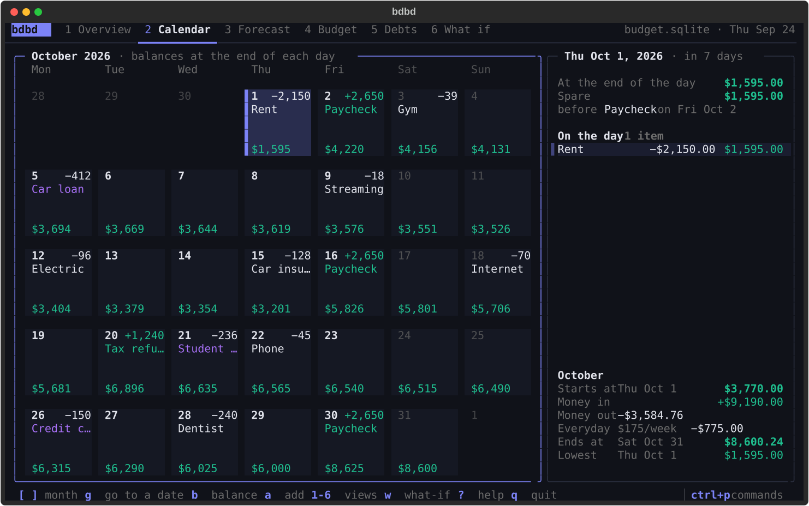
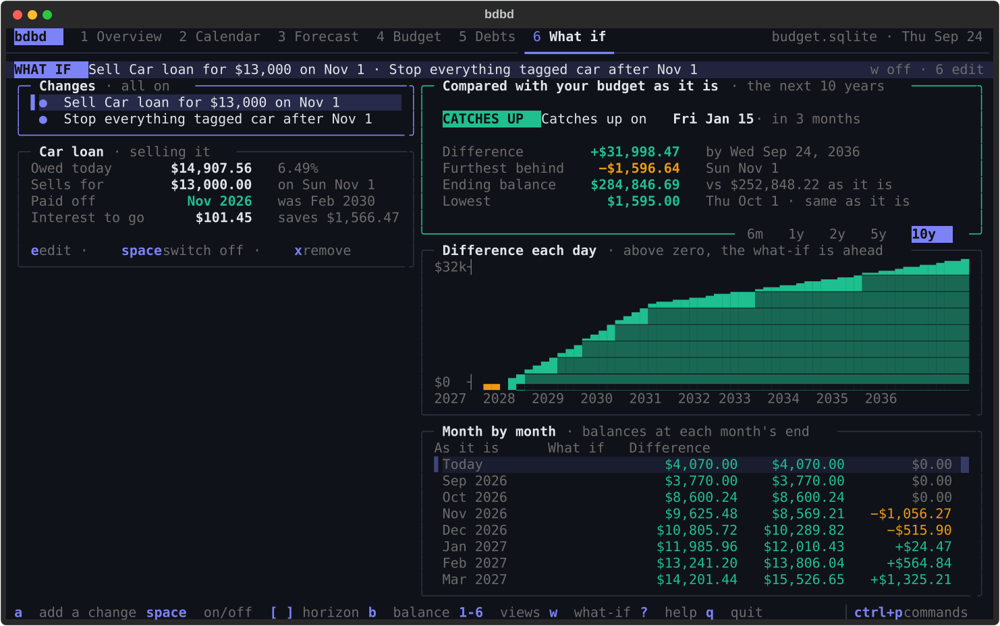
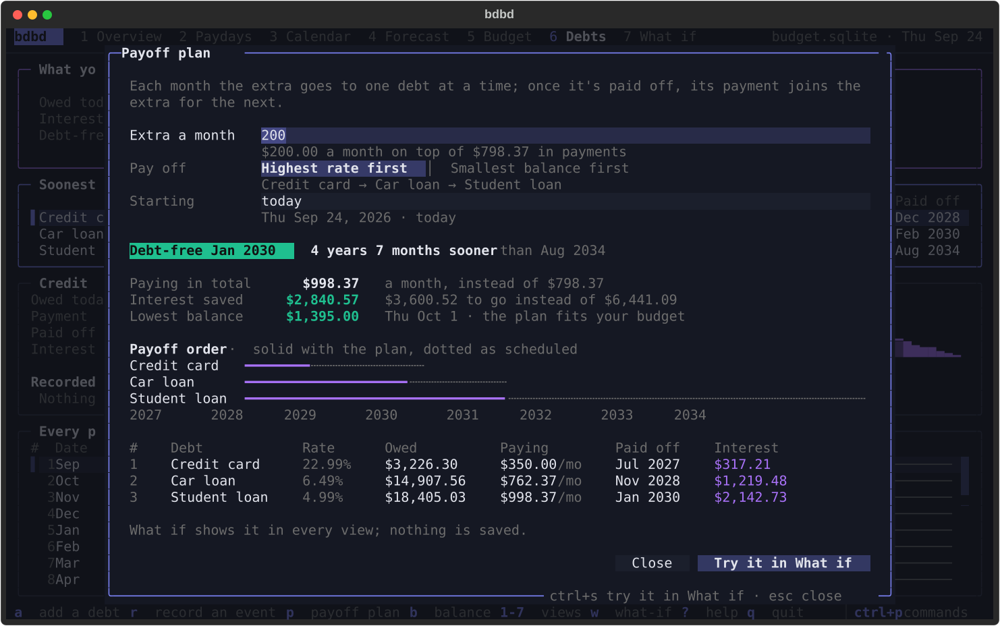

<h1 align="center">bdbd</h1>

<p align="center">
  <b>A beautiful budget in your terminal.</b><br>
  Your incomes, bills and debts, projected day by day, so you always know what's spare until payday.
</p>

<p align="center">
  <a href="https://github.com/adamtrain/bdbd/actions/workflows/ci.yml"></a>
  
  <a href="https://github.com/astral-sh/uv"></a>
  <a href="https://github.com/astral-sh/ruff"></a>
  <a href="LICENSE"></a>
</p>

<p align="center">
  
</p>

## Why bdbd

- **Where you stand, at a glance.** Run `bdbd` and see your balance, the money that's spare until
  payday, the lowest your balance will get, what's coming up and when each debt is gone.
- **Say it the way you'd say it.** `bdbd add Rent 1950 monthly on the 1st --ach`. Dates can be
  `fri`, `oct 15`, `in 3 weeks` or `eom`, and schedules can be "every 2 weeks on fri" or
  "yearly on the 3rd tuesday of november".
- **Your balance, carried forward.** Tell bdbd what's in your account whenever you check. It
  carries that balance through your budget day by day, and when you update it, it tells you how
  far reality has drifted from the plan.
- **Real debt math.** Simple, daily, monthly and continuous interest, rate changes, extra
  payments and payoffs, with amortization tables checked to the cent. No floats anywhere.
- **What-ifs that change nothing.** Pay the car off early, sell it, book a trip: `compare`,
  `breakeven`, `earliest` and `plan` answer "should I?" and "when can I?" without touching
  your budget.
- **Built for agents too.** Add `--agent` to any command and it prints one JSON object, with
  `--select` to keep it small and `bdbd guide` documenting every field.
- **One file, all yours.** Everything lives in a single sqlite file on your machine. No
  account, no server, no sync.

## Install

You'll need [uv](https://docs.astral.sh/uv/).

```sh
uv tool install git+https://github.com/adamtrain/bdbd
bdbd init
```

That puts `bdbd` on your `PATH` and creates an empty budget at `~/.config/bdbd/budget.sqlite`.
To use a budget somewhere else, point `BDBD_DB` at it (or pass `--db PATH`):

```sh
export BDBD_DB=~/Documents/budget.sqlite
```

To hack on bdbd, clone the repo and install it in editable mode, so your changes take effect
right away:

```sh
git clone https://github.com/adamtrain/bdbd && cd bdbd
uv tool install --editable .
```

## Getting started

```sh
bdbd add Paycheck 2650 every 2 weeks on fri from sep 18 --income
bdbd add Rent 2150 monthly on the 1st --ach        # --ach: weekend dates move to Monday
bdbd add "Car insurance" 128 monthly on the 15th --tag car
bdbd add "Car loan" 412.37 monthly on the 5th --tag car,debt
bdbd debt set "Car loan" --balance 14860 --rate 6.49% --compounding simple
bdbd config weekly_spend 175                       # groceries and the like, spread over each day
bdbd balance 4120                                  # what's in your account right now
bdbd                                               # where that leaves you
```

Leave things out of `bdbd add` at a terminal and it asks for them, and shows the next few dates
for each schedule you type so you can check it's right.

<p align="center">
  
</p>

## A month at a glance

`bdbd cal` lays a month out like a calendar: what lands on each day (paychecks in green, debt
payments in purple) and the balance at the end of every day from today on.

<p align="center">
  
</p>

## Commands

| | |
| --- | --- |
| `bdbd` | Where you stand: balance, spare until payday, the low point, what's coming, debts |
| `bdbd balance [AMOUNT]` | Record your balance, or see the one bdbd has carried forward |
| `bdbd upcoming` | Everything coming in and going out, with your balance after each |
| `bdbd cal [MONTH]` | A month at a glance (`oct`, `2026-11`, `next`, `+2`) |
| `bdbd ls` · `show FLOW` · `tags` | Every flow with its schedule, next date and monthly cost |
| `bdbd add` · `edit` · `rm` · `pause` · `resume` | Change the budget |
| `bdbd debts` · `debt …` | What's owed and when it's gone; set up loans, record extra payments, see schedules |
| `bdbd project` | The balance over the months ahead, with the spare money at the end |
| `bdbd spend TAG` | What you'll spend on something between two dates |
| `bdbd summary` | Where the money goes each month and each year, by tag and by flow |
| `bdbd compare` · `breakeven` | Your budget against a what-if, and when the what-if catches up |
| `bdbd earliest` | The first date a what-if keeps your balance above a floor |
| `bdbd plan --extra A` | How fast your debts go with an extra amount each month |
| `bdbd export` · `import` · `sql` · `tidy` · `config` · `guide` | Your data |

`bdbd --help` and `bdbd COMMAND --help` have the details, and `bdbd guide` is the full reference.

## What if…

Every question takes what-if flags, and nothing they describe is saved. Here, selling the car on
Nov 1 for $13,000 (paying off the loan with it, and dropping everything tagged `car`) costs
$1,596.64 at first, catches up with the budget as it is by mid-January, and is $31,998.47 ahead
after ten years:

<p align="center">
  
</p>

```sh
bdbd project --until dec 31 --extra-payment "Car loan:2000@nov 1"
bdbd compare --disable-tag car --add-income "Car sale:13000@nov 1"
bdbd earliest --floor 1000 --add-expense "Flight:650@?"   # '?' is the date to find
bdbd project --on 2026-10-02 --add-expense "Flight:650@?" # then see that date in full
```

`plan` puts an extra amount toward one debt at a time (highest rate first, or smallest balance
first with `--strategy snowball`) and rolls each freed payment into the next:

<p align="center">
  
</p>

## Reading the numbers

| | |
| --- | --- |
| **Balance** | Cash on hand before today's scheduled items. `bdbd balance` records it; everything starts from the latest one, carried forward day by day. |
| **Spare** | The balance minus everything due before the next income, everyday spending included. It's the money you can actually use. |
| **Everyday spending** | `bdbd config weekly_spend 175`: groceries and incidentals, charged a little each day in every projection. |
| **Lowest** | The lowest end-of-day balance ahead: the day to watch. |
| **◆** | A debt payment. Its interest and principal split comes from the loan's own terms. |
| **→Mon** | This flow's weekend dates move to Monday (`--ach`), the way an ACH pull does. |

Balances turn amber below one week of everyday spending, and red below zero.

## For agents and scripts

`--agent` (or `BDBD_AGENT=1`) turns every command into one JSON envelope on stdout. Nothing ever
prompts, errors come back as JSON too, and `--select` keeps only the fields you ask for:

```sh
$ bdbd --agent project --until dec 12 --select spare_balance,spare.next_income,opening.source
{"ok":true,"command":"project","data":{"spare_balance":"8480.72","spare.next_income":{"date":"2026-12-25","name":"Paycheck","amount":"2650.00"},"opening.source":"carried"},"warnings":[]}
```

Money is a string with two decimals, dates are ISO, and `warnings` should always be passed on to
the person. `bdbd --agent guide` returns the full reference, with every command's fields and
recipes for common questions, which is the one thing an agent should read first.

## How it works

bdbd simulates your budget one day at a time. Each flow has an amount and an
[RFC 5545](https://datatracker.ietf.org/doc/html/rfc5545) recurrence rule (the English you type
is translated into one and back), and debts carry their balance, rate, compounding method and
day count. Every day, interest accrues on each debt, then the day's incomes, loan payments,
extra payments and bills land in a fixed order, then a day's share of everyday spending. Money
is integer cents and interest is an exact decimal, so a 30-year schedule doesn't drift by a
cent. Only real payments are rounded.

What-ifs are layered on top of the stored budget for a single question and never written down.
Before each command, bdbd tidies away what only concerns past months: one-offs that have
happened, flows that have ended, debts paid off, and loan balances rolled forward to last
month's end.

## Development

```sh
uv sync                         # set up the environment
uv run pytest                   # run the tests
uv run ruff check . && uv run ruff format .
uv run ty check                 # type-check
uv run scripts/screenshots.py   # regenerate docs/*.svg
```

The screenshots come from a made-up household in `tests/sample.py`, run through the same
commands you use. None of those numbers are anyone's real budget.

```
src/bdbd/
├── cli.py      # every command, and agent mode's envelope
├── budget.py   # opening a budget, the remembered balance, what-if flags
├── ask.py      # the questions the views and agent mode share
├── words.py    # English schedules and dates, both ways
├── agent.py    # JSON shapes and --select
├── guide.md    # the full reference (bdbd guide)
├── core/       # storage, the daily engine, debt math, scenarios and queries
└── ui/         # everything you see: theme, charts, and one module per screen
```

## License

[CC0 1.0](LICENSE). bdbd is dedicated to the public domain.
